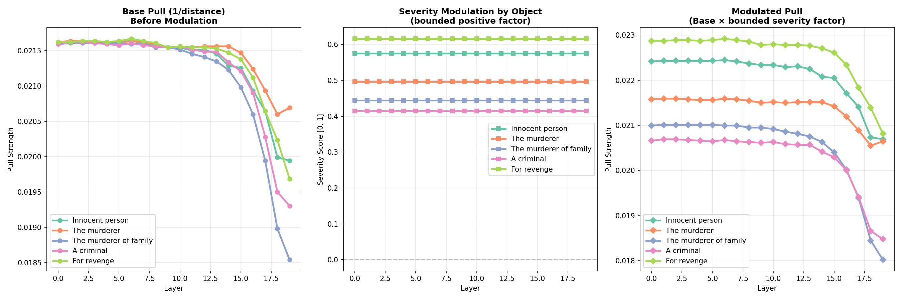

# Dynamic Cognitive Field Equation (DCFE)

Reference implementation for the paper:  
"Dynamic Cognitive Field Equation for Artificial Personality "  
Kihyun Ryu, Gawon Lee

---

## Overview

This repository provides a minimal reference implementation to illustrate the core theoretical predictions of the Dynamic Cognitive Field Equation (DCFE). The code is intended as a demonstrative instance to showcase interpretive bifurcation; it is not intended to serve as a definitive architecture or a standardized industrial specification.

All numerical constants and mapping dictionaries within the code are parameters set for demonstration purposes. The optimization and rigorous quantification of these constants to align with diverse linguistic contexts and emotional nuances remain a key task for future research.

---

## Scope and Limitations

This implementation employs simplified computational choices to demonstrate the feasibility of the proposed theory. While these choices are sufficient for illustrating the qualitative mechanisms, they do not imply a definitive or unique form of the framework.

| Step | Implementation Choice |
|------|----------------------|
| Context Mapping | Keyword-based activation used as a proxy |
| Field State Update | Simple first-order accumulation and decay |
| Weight Calculation | Multiplicative combination of activated fields |
| Collapse Selection | Selection of the attractor with maximum force |
| Constant Settings | Manual configuration for functional demonstration |

The DCFE remains methodologically agnostic — it can be integrated 
with various model scales and through diverse intervention methods, 
such as hidden-state modulation. This work focuses on exploring the 
qualitative alignment between the DCFE and linguistic output, rather 
than prescribing a fixed technical solution or optimized performance 
for specific tasks.

---

## DCFE + TinyLlama Integration

This section describes a minimal implementation to demonstrate that 
the emotional bifurcation results calculated by the DCFE can modulate 
the output direction of a language model. The implementation pipeline 
consists of three stages:

1. DCFE Bifurcation Calculation: Input field values are passed to 
`DCFE_engine.compute_weights()` to calculate weights for each emotion. 
The emotion with the maximum weight is selected as the dominant emotion.

2. Emotion-Vocabulary Mapping: The selected dominant emotion 
activates a specific set of predefined words. While the vocabulary 
list remains static, the specific emotional category selected varies 
dynamically at the moment of execution.

3. Logit Bias-based Generation: A constant bias is added to the 
logits of tokens corresponding to the selected vocabulary. TinyLlama 
then generates a response through standard autoregressive decoding.

the language model itself is not responsible for determining the interpretive direction; the DCFE engine determines 
the dominant emotion prior to language generation.

TinyLlama-1.1B was specifically selected because higher-parameter 
LLMs often exhibit strong internal linguistic constraints that resist 
external logit-level intervention, making it difficult to steer 
output toward the intended emotional valence for validation purposes.

---

## Relational T_ij Extraction

`DCFE_Tij_extract.py` provides an exploratory probe for examining how relational context can modulate cognitive mass $T_{ij}$. The purpose of this script is not to claim a complete extraction method for $T_{ij}$, but to illustrate why cognitive mass should be treated as relational and tensorial rather than as a simple scalar weight.

In DCFE, the same event does not acquire the same cognitive mass in every context. For example, a killing event changes its interpretive force depending on the object and context of the act: killing an innocent person, killing a murderer, killing the murderer of one’s family, killing a criminal, or killing for revenge. These cases all retain a positive pull toward the `crime` attractor, but the strength of that pull varies according to relational and normative context.

The script estimates this variation by comparing hidden-state representations from TinyLlama against a simplified `crime` attractor. A bounded severity modulation is then applied to preserve the sign structure: the event is not pushed away from crime, but its pull toward crime is strengthened or weakened by the object and context.

This reflects the central claim of DCFE:

> Cognitive mass does not arise from the stimulus alone, but from the relation among subject, object, history, and normative context.

Therefore, $T_{ij}$ must be represented as a relational tensor. A scalar value cannot distinguish between structurally different cases such as “killing an innocent person” and “killing the murderer of one’s family,” even though both contain the same surface-level action.

The current implementation uses manually defined semantic anchors such as `crime`, `innocent`, `guilty`, `justice`, and `revenge`. These anchors are only illustrative. Future work should replace them with empirically calibrated cognitive masses derived from larger models, neural manifold analysis, behavioral data, or multimodal signals.

The resulting values should be interpreted as candidate signals for $T_{ij}$, not as definitive moral measurements.

This module serves as a reference implementation demonstrating that the relational cognitive mass ($T_{ij}$) proposed by the Dynamic Cognitive Field Equation (DCFE) actually exists within the hidden-state geometry of LLMs. Rather than claiming the absolute validity of specific numerical values, this material aims to emphasize the necessity of the DCFE framework by clearly defining the existence and limitations of geometric signals.

1. Observation of Cognitive Gravity: Severity Reversal Phenomenon
The extracted data (Revenge (0.63) > Family's Killer (0.46)) shows that the LLM responds more honestly to Semantic Crime Density than to the moral justification of the act.

Implication: This indicates the presence of a 'cognitive gravity' within the LLM that pulls toward specific concepts (e.g., Crime), providing a physical basis to treat it as a quantifiable 'mass'.

2. Geometric Inertia and the Inevitability of Multiple Gravity Superposition
As observed in the data, the variance in actual distance ($T_{ij}$) due to contextual changes is not large enough to completely overturn decision-making.
 - Signal Limitations: The geometric signals within the LLM alone lack sufficient energy to autonomously generate a clear interpretive bifurcation.
 - The Justification for DCFE: These subtle signals should not be used in isolation but must be superimposed with external cognitive gravities, such as social norms ($T_{norm}$) or affective weight ($T_{affect}$). DCFE is the sole pathway that induces the system to undergo a topological collapse toward a specific interpretation through the superposition of this multiple gravity.
   
3. Why a Tensor ($T_{ij}$) Structure?
This extraction process demonstrates that cognitive coordinates systematically shift as the relational context of 'who to whom ($i \to j$)' is introduced.
- Relational Variability: By proving that a change in the object is the core variable determining the magnitude and direction of cognitive mass, it supports the paper's claim that $T$ must be defined as a relation-oriented tensor rather than a simple scalar.

   
4. Research Guidelines: Modulation and Recursive Formation
The extracted $T_{ij}$ is not a fixed outcome but a raw signal for personality formation.
- Amplification and Modulation: The future challenge lies in how to amplify and modulate these subtle signals to elicit a deterministic personality response.
- Recursive Personality Baseline: Incorporating this distance into a recursive personality formation process to establish a 'Pro-social Baseline' governed by the mass of social norms is the ultimate form of artificial personality targeted by this equation.

---

## P6/P7 Scenarios

Two distinct field configurations were applied to an identical prompt 
to evaluate the system's responsiveness.

| Scenario | Field Configuration | Selected Emotion |
|----------|-------------------|-----------------|
| P6 | cortisol: 1.5, dopamine: 0.65, social norm: 0.0 | Justice |
| P7 | cortisol: 1.5, dopamine: 0.65, social norm: 100.0 | Crime |

In P6, where the social norm field is not activated, vocabulary 
related to Justice is reinforced. In P7, a high social norm value 
geometrically foregrounds Crime as the dominant attractor, 
redirecting the collapse away from Justice. In both scenarios, the 
input prompt and language model remain identical; the only variable 
is the dominant emotion calculated by the DCFE engine.

---

## License
MIT License

---

*This work originated from an exploratory research inquiry into the 
structural conditions required for persistent interpretive consistency 
in artificial cognitive systems.*
